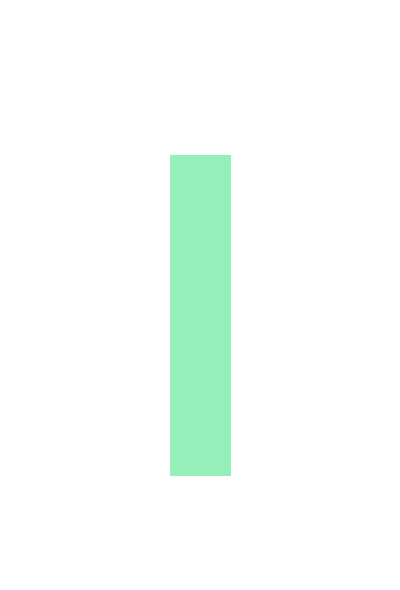

# donation-thermometer

A automatic donation thermometer for your website, OBS stream or any other use. Queries idonate.ie for the current total and goal of a campaign and displays it in a thermometer style.

## Usage

#### thermometer_config.py:
```python
loop_times = 10000 # Number of times to upda the total (updates randomly between 100 and 300 seconds)
url = "https://www.idonate.ie/fundraiser/MediaProductionSociety11" # URL of the idonate.ie campaign
output_file = "donation_thermometer.png" # Output file
border_color = (255, 255, 255) # Color of the border
mercury_color = (149, 239, 185) # Color of the mercury
font_path = "GaretHeavy.ttf" # Path to the font file
font_size = 50 # Font size
```

## Example of the thermometer:


## Example of the latest donation:
